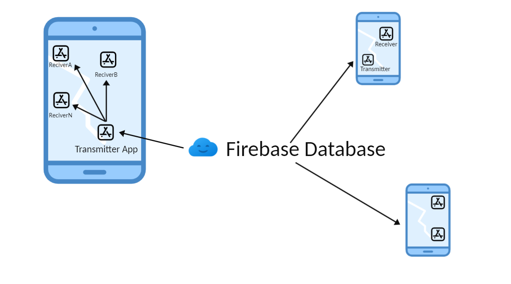

# ConfigCentre

## Problem statement
* Imagine we have a system where settings for apps in an Android device are configured in a backend. Example of settings may range from colour schemes to credentials for accessing other services.
* We don't want all the intended apps to make calls to the backend. Instead, we want a single configuration app making requests to the backend and then provide settings to each app. Each app should only access their own settings (e.g. you don't want to provide credentials to the wrong app).
* New settings can arrive at any moment.

## Solution application design

## Android application important components
* **Firebase database:** The database stores package specific configuration. This is created using Firebase console.
* **Transmitter Android application:** This application periodically polls (every 15 minutes) for updated data in Firebase database. Once it gets the data, it sends broadcasts to relevant applications available in device.
* **How periodic request/polling is maintained?** Using WorkManager API. The transmitter application retrieves the data every 15 minutes from Firebase database. 
* **Receiver Android application:** This Android application receives configuration updates periodically from Transmitter app and shows it in the application.
* **How Transmitter application makes sure that Receiver application only receives configuration relevant to itself?** Firebase database stores package specific configuration. So, once transmitter app receives data from database, it broadcasts package/receiver specific configuration. Eventually receiver app receives configuration relevant to itself.

## What is not handled   
* **New settings can arrive at any moment:** android application cannot assure periodic polling even when they are backgrounded or not running. WorkManager API assures periodic polling and eventually assures that receiver application receives configuration updates. If this is critical business requirement, then Firebase Cloud Messaging (FCM) should be implemented, it will update receiver application immediately when there is a change in receiver specific configuration.
   
* **Unit testing is still not implemented**

## How to test applications?
* Install transmitter app in the device
* Install receiver app in the device, if there is an update in configuration, receiver application should receive updates within 15 minutes
